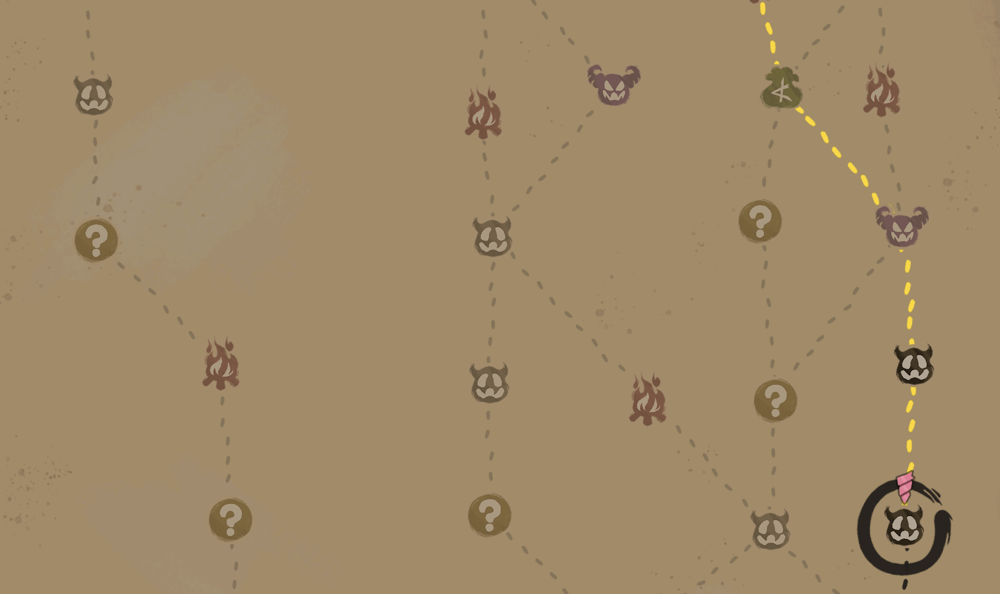

# RouteSuggest - Slay the Spire 2 Mod



A mod for Slay the Spire 2 that suggests the optimal path through the map and highlights it in gold/red on the map screen.

**Supported game versions:** v0.98.3 and v0.99.1 (public beta)

## Features

- **Dual path suggestions**: Shows two optimal routes - a safe path and an aggressive path
- **Visual highlighting**:
  - **Gold**: Safe path (minimizes risk)
  - **Red**: Aggressive path (prioritizes combat for rewards)
- **Smart scoring**: Different weights for safe vs aggressive playstyles
- **GUI Configuration**: Full in-game configuration via ModConfig (optional)
- **Manual Configuration**: Direct JSON configuration for advanced users

## Installation

1. Download the latest release from [GitHub releases](https://github.com/jiegec/STS2RouteSuggest/releases) or [Nexus mods](https://www.nexusmods.com/slaythespire2/mods/54)
2. Extract the mod files to your Slay the Spire 2 mods folder (`mods` folder should reside in the same folder as the game executable):
   - **macOS**: `~/Library/Application\ Support/Steam/steamapps/common/Slay\ the\ Spire\ 2/SlayTheSpire2.app/Contents/MacOS/mods/`
   - **Linux**: `~/.steam/steam/steamapps/common/Slay\ the\ Spire\ 2/mods`
3. Launch Slay the Spire 2 - the mod will load automatically

## Building from Source

### Prerequisites

- .NET 9.0 SDK or later
- Godot 4.5.1 with Mono support
- Slay the Spire 2 (for the sts2.dll reference)

### Build Steps

```bash
# Clone the repository
git clone https://github.com/jiegec/STS2RouteSuggest
cd RouteSuggest

# Build the mod
./build.sh

# Install the mod
./install.sh
```

## How It Works

The mod calculates two optimal paths using different scoring systems:

### Safe Path (Gold)

Minimizes encounters and prioritizes safety:

| Room Type     | Score | Reason                         |
|---------------|-------|--------------------------------|
| **Rest Site** | +1    | Heal and upgrade cards         |
| **Treasure**  | +1    | Free relic                     |
| **Shop**      | +1    | Buy cards, relics, and potions |
| **Monster**   | -1    | Avoid combat                   |
| **Elite**     | -3    | Avoid hard encounters          |
| **Boss**      | 0     | Final destination              |

### Aggressive Path (Red)

Prioritizes combat rewards and unknown encounters:

| Room Type     | Score | Reason                         |
|---------------|-------|--------------------------------|
| **Rest Site** | +1    | Heal and upgrade cards         |
| **Treasure**  | +1    | Free relic                     |
| **Shop**      | +1    | Buy cards, relics, and potions |
| **Monster**   | +2    | Gold and card rewards          |
| **Elite**     | +3    | Relics and better rewards      |
| **Unknown**   | +2    | Potential for combat           |
| **Boss**      | 0     | Final destination              |

When both paths share an edge, it appears in gold.

## Configuration

### GUI Settings (Recommended)

RouteSuggest optionally integrates with [**ModConfig**](https://github.com/xhyrzldf/ModConfig-STS2). When ModConfig is installed, RouteSuggest appears in the game's **Settings > Mods** menu. If ModConfig is not installed, the mod still works normally, but you'll need to edit the JSON configuration file manually (see below).

With ModConfig GUI, you can:

- **General Settings**:
  - **Highlight Type**: Choose to highlight one optimal path or all paths with optimal score
    - **One**: Pick one path from among optimal paths
    - **All**: Highlight all paths tied for the best score
- **Configure each path**:
  - **Name**: Identifier for the path
  - **Color**: Enter hex color code (e.g., `#FFD700` for gold, `#FF0000` for red)
  - **Priority**: Slider to set rendering priority (higher = renders on top when paths overlap)
  - **Scoring Weights**: Sliders for each room type
    - Positive = prefer this room type
    - Negative = avoid this room type
    - Zero = neutral
- **Add New Path**: Slider to add a new path (slide to 1)
- **Remove Path**: Each path has a slider to remove it (0=keep, 1=remove)
- **Reset to Defaults**: Slider to reset all paths to default configuration
- **Changes are saved automatically** to the config file location (see below for details)

### Manual JSON Configuration

Alternatively, you can customize the path types by manually editing `RouteSuggestConfig.json`:

- **Existing users**: If you already have a config file at `mods/RouteSuggestConfig.json`, it will continue to be used (no migration needed)
- **New users**: The config will be saved alongside `RouteSuggest.dll` (found recursively in the mods folder). If the DLL cannot be found, it falls back to `mods/RouteSuggestConfig.json`
- **Note**: Config is saved to the same location where it was read from. The mod will not automatically migrate the config file to a different location.

```json
{
  "schema_version": 2,
  "highlight_type": "One",
  "path_configs": [
    {
      "name": "Safe",
      "color": "#FFD700",
      "priority": 100,
      "scoring_weights": {
        "RestSite": 1,
        "Treasure": 1,
        "Shop": 1,
        "Monster": -1,
        "Elite": -2
      }
    },
    {
      "name": "Aggressive",
      "color": "#FF0000",
      "priority": 50,
      "scoring_weights": {
        "RestSite": 1,
        "Treasure": 1,
        "Shop": 1,
        "Monster": 1,
        "Elite": 2,
        "Unknown": 1
      }
    }
  ]
}
```

- **highlight_type**: "One" (pick one optimal path) or "All" (highlight all paths with optimal score)
- **color**: Hex color code (e.g., `#FFD700` for gold, `#FF0000` for red)
- **priority**: Higher values render on top when paths overlap
- **scoring_weights**: Integer values for each room type (positive = preferred, negative = avoid)

Available room types: `RestSite`, `Treasure`, `Shop`, `Monster`, `Elite`, `Unknown`, `Boss`

If the config file is missing or invalid, default path configs are used.

## Changelog

### v1.6.0

- Improved config file path resolution
  - Based on user feedback: when there are many mods in the folder, having the config file at the root level becomes messy
  - If `mods/RouteSuggestConfig.json` exists, continue using it (no migration needed)
  - Otherwise, find `RouteSuggest.dll` recursively and save config alongside it
  - Fallback to `mods/RouteSuggestConfig.json` if DLL not found
  - Config is saved to the same location where it was read from (no automatic migration)

### v1.5.0

- Add HighlightType option to control how many paths to highlight
  - **One**: Pick one path from among optimal paths
  - **All**: Highlight all paths with the optimal best score
  - Available in both ModConfig GUI and JSON config

### v1.4.0

- Added GUI Settings integration with ModConfig for in-game path configuration
  - Configure name, color (hex input), priority, and scoring weights via GUI
  - Add/remove custom path types
  - Changes saved to JSON automatically
  - Use slider instead of button for now
  - I18n support for English and Simplified Chinese
- Tested on game beta v0.99.1

### v1.3.0

- Tuned the default weights for safe/aggressive paths
- Added configurable paths via `mods/RouteSuggestConfig.json`
- Path configs can be customized with custom colors, priorities, and scoring weights
- Falls back to defaults if config file is missing or invalid

### v1.2.0

- Fixed path highlighting when entering a new act

### v1.1.0

- Added dual path mode: safe path (gold) and aggressive path (red)
- Safe path minimizes combat encounters
- Aggressive path prioritizes Elite (+2), Monster (+1), and Unknown (+1) rooms
- Overlapping edges shown in gold

### v1.0.0

- Initial release
- Support for game versions v0.98.3 and v0.99
